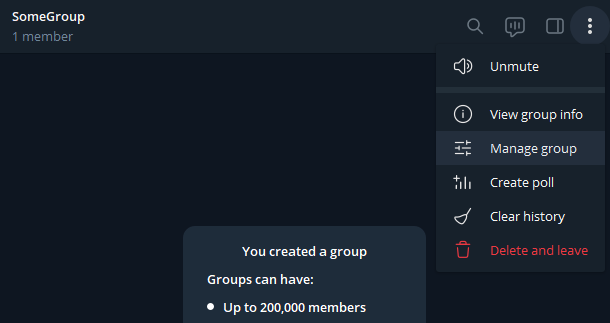
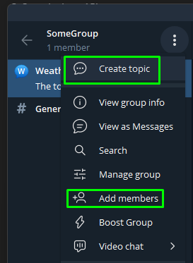
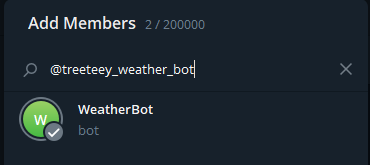
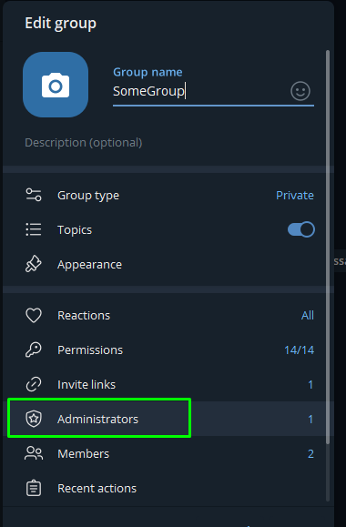
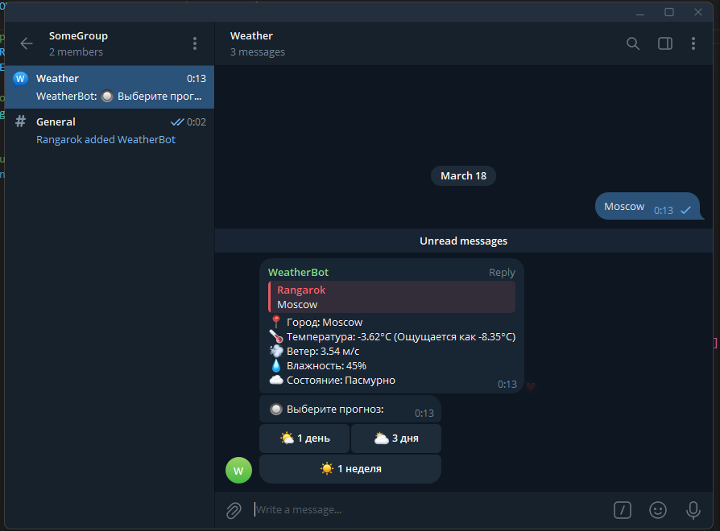

# Telegram_Weather_Bot
Bot that fetches data from openweather.com using its API for personal/specific channel.

1. Go to **@BotFather** in telegram
2. Input `/newbot`. Create bots name.
3. Save the bot's token
4. Sign in to `https://openweathermap.org/api` and create API key. Save it.
5. Create group in Telegram. Go to group settings -> Manage group -> Enable "Topics"
   
   

   

6. Create new topic and invite **YOUR** bot.

    

    

7. Make bot as administrator of that group

    

8. Get group and topic ID. (as a homework find it yourself)
9. To make bot **"private"** you need to insert those IDs in `weatherbot.py` script at `ALLOWED_CHAT_ID` and `ALLOWED_TOPIC_ID`. That way **only your** topic can work with that bot. Insert `BOT_TOKEN` and `WEATHER_API_KEY`  also.
10. Install modules `pip install -r requirements.txt`
11. Launch bot `py weatherbot.py`. In your topic input city name.

    

<br><br><br><br>

## Запуск в Docker

1. ``` 
   curl -O https://github.com/Treeteey/Telegram_Weather_Bot.git 
   ```
2. Убедитесь, что у вас установлен Docker и Docker Compose
3. Скопируйте файл с примером переменных окружения:
   ```bash
   cp .env.example .env
   ```
4. Отредактируйте файл `.env`, вставив в него ваши данные:
   - `BOT_TOKEN` - токен вашего бота
   - `WEATHER_API_KEY` - ключ API OpenWeatherMap
   - `ALLOWED_CHAT_ID` - ID вашей группы
   - `ALLOWED_TOPIC_ID` - ID темы в группе
5. Сделайте скрипт запуска исполняемым:
   ```bash
   chmod +x docker/run.sh
   ```
6. Запустите бота:
   ```bash
   ./docker/run.sh
   ```

Бот будет запущен в Docker-контейнере и автоматически перезапустится при перезагрузке сервера.

Для остановки бота используйте:
```bash
docker stop weather-bot
```

Для просмотра логов:
```bash
docker logs weather-bot
```

<br><br><br><br>

## Быстрая установка

1. Скачайте репозиторий:
   ```bash
   git clone https://github.com/Treeteey/Telegram_Weather_Bot.git
   cd Telegram_Weather_Bot
   ```

2. Создайте файл `.env` в корневой директории проекта со следующими переменными:
   ```
   cp .env.example .env 

   BOT_TOKEN=your_telegram_bot_token
   WEATHER_API_KEY=your_openweathermap_api_key
   ALLOWED_CHAT_ID=your_telegram_chat_id
   ALLOWED_TOPIC_ID=your_telegram_topic_id
   ```

3. Запустите скрипт установки:
   ```bash
   chmod +x setup.sh
   ./setup.sh
   ```

<br><br><br><br>

## Для личного пользования - подсказки

### Обновление файлов из репозитория

Если вам нужно обновить только измененные файлы из репозитория (например, `weatherbot.py`):

```bash
# Создаем временную директорию и клонируем репозиторий
git clone https://github.com/Treeteey/Telegram_Weather_Bot.git temp_update

# Копируем только нужный файл
cp temp_update/weatherbot.py .

# Удаляем временную директорию
rm -rf temp_update

# Если вы изменили weatherbot.py, нужно пересобрать Docker образ
```

> ⚠️ **Важно**: 
> - Ваш файл `.env` с конфиденциальными данными останется нетронутым, так как мы используем отдельную временную директорию
> - Если вы внесли свои изменения в `weatherbot.py`, сначала сделайте их резервную копию:
>   ```bash
>   cp weatherbot.py weatherbot.py.backup
>   ```
> - После обновления можно сравнить файлы:
>   ```bash
>   diff weatherbot.py weatherbot.py.backup
>   ```

### Управление Docker-контейнером

Для пересборки и перезапуска контейнера:

```bash
# Останавливаем текущий контейнер
docker stop weather-bot

# Удаляем контейнер
docker rm weather-bot

# Удаляем образ
docker rmi weather-bot

# Пересобираем и запускаем заново
./docker/run.sh
```

Полезные команды для отладки:
```bash
# Просмотр логов в реальном времени
docker logs -f weather-bot

# Просмотр статуса контейнера
docker ps -a | grep weather-bot

# Вход в работающий контейнер для отладки
docker exec -it weather-bot /bin/bash
```

Если у вас возникла ошибка "pull access denied":
```bash
# Войдите в Docker Hub (если нужно)
docker login

# Или соберите образ локально без попытки загрузки
docker build -t weather-bot -f docker/Dockerfile .
```

## Возможности

- Получение текущей погоды в любом городе
- Прогноз погоды на 1, 3 или 5 дней
- Почасовая информация о температуре, ветре и состоянии погоды
- Визуальное отображение погодных условий с помощью эмодзи

## Использование

1. Отправьте боту название города
2. Выберите период прогноза (1, 3 или 5 дней)
3. Получите подробный прогноз погоды

## Для разработчиков

### Структура проекта

- `weatherbot.py` - основной код бота
- `docker/` - файлы для Docker
- `docker/Dockerfile` - инструкции для сборки Docker-образа
- `docker/run.sh` - скрипт для запуска бота в Docker
- `setup.sh` - скрипт для проверки и запуска бота
- `requirements.txt` - зависимости Python

### Обновление файлов

1. Внесите изменения в код
2. Пересоберите Docker-образ:
   ```
   cd docker
   ./run.sh
   ```

## Лицензия

MIT
