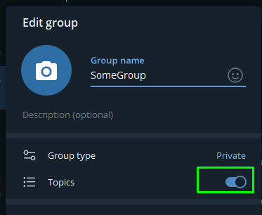

# Telegram_Weather_Bot
Bot that fetches data from openweather.com using its API for personal/specific channel.

1. Go to **@BotFather** in telegram
2. Input `/newbot`. Create bots name.
3. Save the bot's token
4. Sign in to `https://openweathermap.org/api` and create API key. Save it.
5. Create group in Telegram. Go to group settings -> Manage group -> Enable "Topics"
   
   

   

6. Create new topic and invite **YOUR** bot.

    

    

7. Make bot as administrator of that group

    

8. Get group and topic ID. (as a homework find it yourself)
9. To make bot **"private"** you need to insert those IDs in `weatherbot.py` script at `ALLOWED_CHAT_ID` and `ALLOWED_TOPIC_ID`. That way **only your** topic can work with that bot. Insert `BOT_TOKEN` and `WEATHER_API_KEY`  also.
10. Launch bot `py weatherbot.py`. In your topic input city name.

    
